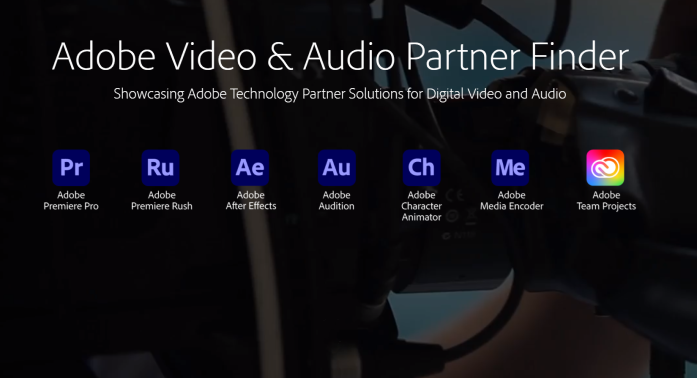

<Hero slots="image, icon, heading, text, buttons" variant="halfwidth" />

#  Build your favorite new feature in Premiere Pro

Seamlessly connect tools in your workflow using Premiere Pro APIs. Automate complex tasks, communicate with external hardware, add support for new file formats and codecs, design new effects and transitions, and add panels that seamlessly fit into the editing workspace.

* [Get the SDKs](https://console.adobe.io/downloads/pr)

<TextBlock slots="image, heading, text" width="33%" theme="light" isCentered />

### Automate complex workflows

Simplify the search and ingest of source media, and automate tedious and error-prone steps for final delivery.

<TextBlock slots="image, heading, text" width="33%" theme="light" isCentered />

### Add support for new file formats 

Add importer and/or exporter plug-ins to work directly with new file formats and codecs without transcoding.

<TextBlock slots="image, heading, text" width="33%" theme="light" isCentered />

### Integrate external hardware

Use the control surface API to sync Premiere Pro with hardware faders, VU meters, color grading controls, and more.

<TextBlock slots="image, heading, text" width="33%" theme="light" isCentered />

### Build effects and transitions

Extend After Effects plug-ins running in Premiere Pro and add GPU rendering interoperability.

<TextBlock slots="image, heading, text" width="33%" theme="light" isCentered />

### Transmit the Premiere Pro Monitor   to any destination 

Mercury Transmit plug-ins can send video, audio, and closed captioning to any external device or connection.

<TextBlock slots="image, heading, text" width="33%" theme="light" isCentered />

### Manage your metadata 

Get and set all metadata associated with project items, including all supported marker types.

<TextBlock slots="image, heading, text" width="50%" theme="light" isCentered />

### Preview external content 

Set up the Premiere Pro Source Monitor to preview footage in any supported format, even without bringing the footage into the current project.

<TextBlock slots="image, heading, text" width="50%" theme="light" isCentered />

#### Build with standard web tools 

 Build extensions using standard HTML, CSS and JavaScript. Connect to any third-party web services you like, and  script across Adobe Creative Cloud applications.

<TextBlock slots="image, heading, text1, buttons" theme="dark" />

<!--  -->

### Find Powerful Partners

We’ve found that one of the greatest challenges our customers have is navigating through a large partner eco-system to find the solution that best suits their unique workflow requirements. The Partner Finder was designed to make this process easier by including a company overviews, use case information and other useful information about these companies and their products.

* [Video & Audio Partner Finder](https://adobe-video-partner-finder.com/)

<TextBlock slots="image, heading, text, links" width="33%" theme="dark" isCentered />

### Frame.io 

A real-time, connected solution for collaboration with editors, producers and clients.

* [Learn more](https://frame.io/premiere)

<TextBlock slots="image, heading, text, links" width="33%" theme="dark" isCentered />

### Pond5 

An easy way to find, test, and buy footage, music, and sound effects for your project.

* [Learn more](https://creative.adobe.com/addons/products/13587#.WTW5vDOZNE4)

<TextBlock slots="image, heading, text, links" width="33%" theme="dark" isCentered />

### FilmImpact 

Choose from various packs to get transitions and motion for your videos.

* [Learn more](https://www.filmimpact.net/plugins)

<SummaryBlock slots="image, heading, text, buttons" background="rgb(246, 16, 27)" />

## Subscribe to the Creative Cloud developer newsletter 

A monthly newsletter featuring news for anyone who creates, develops, or build plugins, extensions, or integrations for the
Creative Cloud family of products.

* [Subscribe to the newsletter](https://www.adobe.com/subscription/ccdevnewsletter.html)